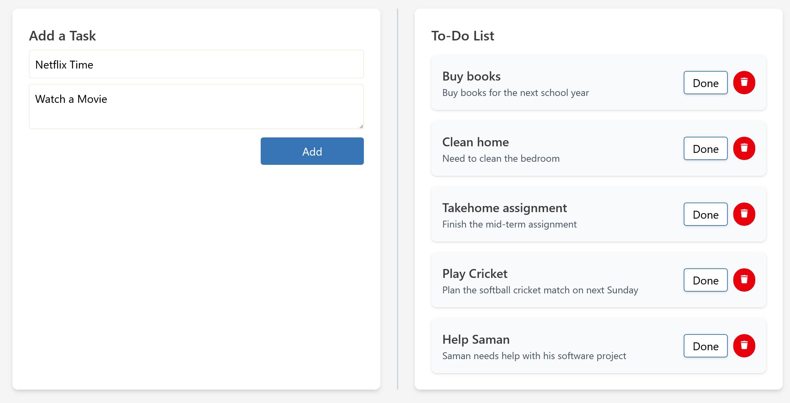

<h1>To-Do List Application</h1>

This is a simple Full Stack To-Do List Application built using:

<ul>
  <li>Frontend → React.js</li>
  <li>Backend → Node.js</li>
  <li>Database → MySQL</li>
</ul>

<h2>1. System Functionalities</h2>

<ul>
  <li><strong>Add New Task</strong> - Add tasks with a title and description.</li>
  <li><strong>View Tasks</strong> - Display recent 5 tasks from database in real-time.</li>
  <li><strong>Mark as Done / Undo</strong> - Update task status to done or undo it back to pending.</li>
  <li><strong>Delete Task</strong> - Remove any task permanently from the database.</li>
</ul>

<h2>2. How to Start the System</h2>

<h3>Prerequisites</h3>
<ul>
  <li>React.js</li>
  <li>Node.js</li>
  <li>MySQL</li>
</ul>

<h3>2.1 Start Frontend (React.js)</h3>
<pre>
cd Client
cd to-do-app
npm install
npm run dev
</pre>

<h3>2.2 Start Backend (Node.js & Express.js)</h3>
<pre>
cd Server
npm install
npx nodemon src/Server.js
</pre>

<h3>2.3 Setup Database (MySQL)</h3>

<ol>
  <li>Create a new database in MySQL</li>
</ol>

<pre>
CREATE DATABASE todo_db;
USE todo_db;
</pre>

<ol start="2">
  <li>Create tasks table</li>
</ol>

<pre>
CREATE TABLE task (
    id INT AUTO_INCREMENT PRIMARY KEY,
    title VARCHAR(255) NOT NULL,
    description TEXT NOT NULL,
    done BOOLEAN DEFAULT FALSE,
    created_at TIMESTAMP DEFAULT CURRENT_TIMESTAMP
);
</pre>

<h2>3. System Demonstration</h2>

<h3>→ Home Screen</h3>

This is the home screen of the system

<h3>→ Add New Task</h3>

Enter Task Title & Description Click <code>Add</code> button

<h3>→ View Tasks</h3>

Displays all your tasks in real-time.

<h3>→ Mark as Done / Undo</h3>

Click <code>Done</code> or <code>Undo</code> button on each task.

<h3>→ Delete Task</h3>

Click the Delete icon to delete the task.

